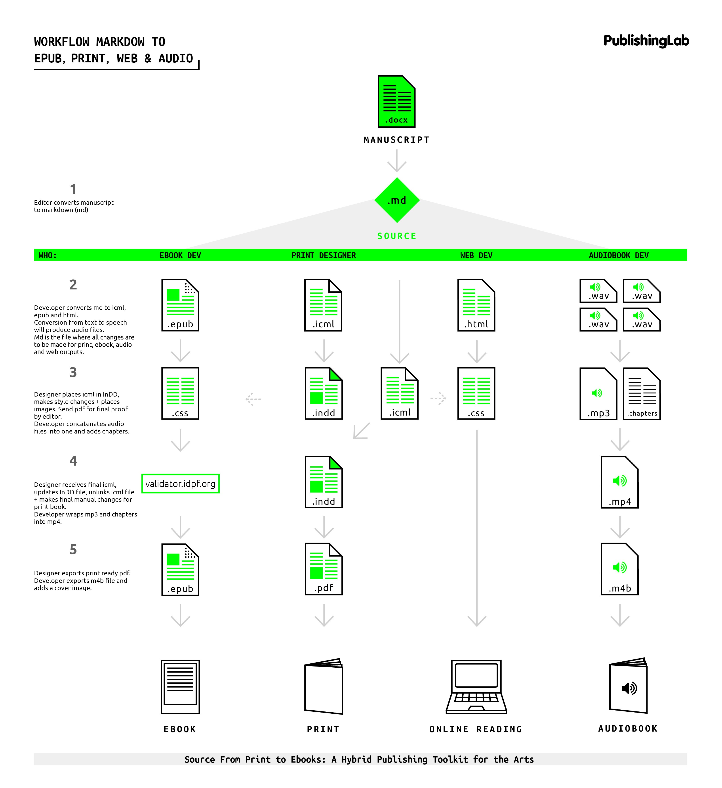

# Publicación Híbrida

La publicación híbrida es un concepto desarrollado en el [PublishingLab de Ámsterdam](https://www.publishinglab.nl/), un proyecto de investigación basada en la práctica, que se enfoca en producir soluciones de publicación digital enfocada en publicación independiente, abierta y colaborativa.

Junto con el [Institute of Networked Cultures](https://networkcultures.org/) han producido series de publicaciones periódicas, libros, manuales de publicación digital, metodologías y flujos de trabajo para publicación digital e híbrida.

### Tipos de publicación híbrida

* Uno-a-uno: el libro se considera como un producto o proyecto específico donde los autores de texto, ilustradores, artistas, fotógrafos y diseñadores trabajan juntos para crear el libro, que luego se publica como una edición única. El libro impreso también se puede convertir o adaptar en un libro electrónico.
* Uno a muchos: la publicación tiene una variedad de apariencias, según el contexto y los medios de presentación disponibles \(tipo y tamaño de la pantalla/papel\). El libro se ofrece en formatos como el impreso, EPUB, PDF, MOBI, web, cada uno con una apariencia y funcionalidad adecuadas al formato que se utiliza.

### Flujo de trabajo para la Publicación Híbrida

El flujo de trabajo consiste en usar formas de trabajo y tecnologías estructuradas como lenguajes de marcado semánticos y formatos de archivo estandarizados para la gestión de los materiales y componentes del libro.  Para así realizar un proceso de producción semi automatizado para diferentes plataformas de lectura, usando una sola fuente de texto.

### Hybrid Publishing Toolkit

Es un manual de producción editorial enfocado en la creación de libros, catálogos y publicaciones para diferentes dispositivos y contextos de lectura \(impresa, web y electrónica\).



